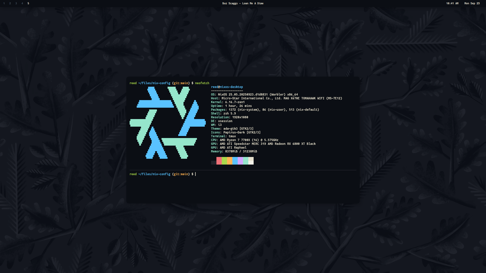

# nix-config

**My NixOS [home-manager](https://github.com/rycee/home-manager) config files**

[](https://github.com/reedrw/nix-config/actions?query=workflow%3A%22Build+and+populate+cache%22) [](https://reedrw.cachix.org)

## Screenshot


## Try it out!

```sh
git clone https://github.com/reedrw/nix-config
cd nix-config
./install.sh --build-vm
```
